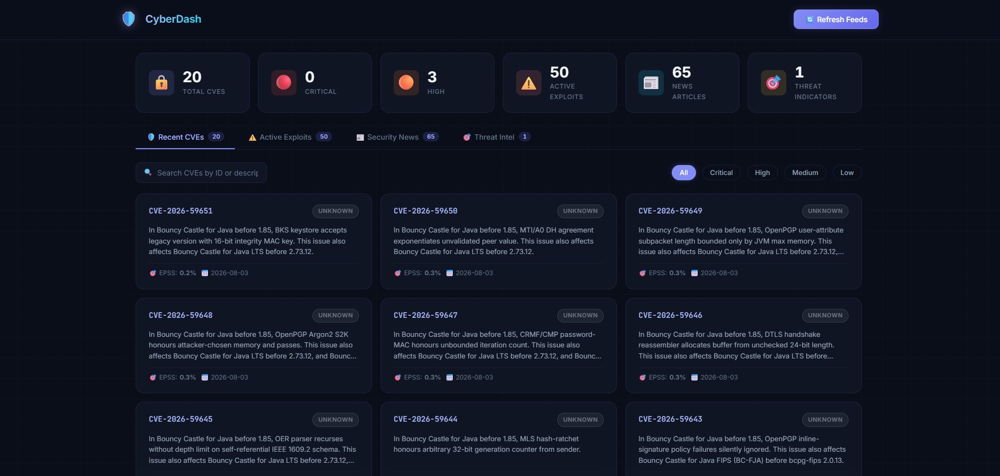

# CyberDash — Python Cyber Security Dashboard

A **beginner-friendly** real-time cybersecurity dashboard built with Python, FastAPI, and SQLite.

This project aggregates vulnerability data, active exploit alerts, security news, and threat intelligence from public feeds — all while teaching Python fundamentals through heavily commented code.

---



---

## 🚀 Quick Start

### 1. Set Up the Virtual Environment

```bash
cd cyber_dashboard

# Create a virtual environment (only needed once)
python3 -m venv .venv

# Activate the virtual environment
source .venv/bin/activate

# Install dependencies
pip install -r requirements.txt
```

### 2. Run the Dashboard

```bash
# Make sure you are in the project root directory
cd cyber_dashboard

# Start the web server
python -m app.main
```

### 3. Open in Your Browser

- **Dashboard**: [http://127.0.0.1:8000](http://127.0.0.1:8000)
- **API Docs**: [http://127.0.0.1:8000/docs](http://127.0.0.1:8000/docs)

### 4. Load Data

Click the **"🔄 Refresh Feeds"** button on the dashboard to fetch data from all external sources. This will populate the database with:
- Recent CVEs from the National Vulnerability Database
- CISA Known Exploited Vulnerabilities
- Security news from RSS feeds
- Threat indicators from Abuse.ch

---

## 📂 Project Structure

```
cyber_dashboard/
├── app/
│   ├── __init__.py          # Package initializer (explains Python packages)
│   ├── main.py              # FastAPI routes & server entry point
│   ├── config.py            # All settings, URLs, and constants
│   ├── database.py          # SQLite setup & table creation
│   ├── models/
│   │   └── schemas.py       # Pydantic data models (type validation)
│   ├── services/
│   │   ├── cve_service.py   # NVD vulnerability fetcher
│   │   ├── cisa_service.py  # CISA exploit catalog fetcher
│   │   ├── rss_service.py   # RSS news feed aggregator
│   │   ├── threat_service.py # Abuse.ch threat intel fetcher
│   │   └── db_service.py    # Database query helpers
│   ├── static/
│   │   ├── css/style.css    # Dark-mode cyber UI styles
│   │   └── js/dashboard.js  # Client-side interactivity
│   └── templates/
│       ├── base.html        # Master layout template
│       ├── index.html       # Main dashboard page
│       └── components/      # Reusable card templates
├── requirements.txt         # Python dependencies
└── README.md                # This file
```

---

## 🔌 Data Sources

| Source | What It Provides | Update Method |
|--------|-----------------|---------------|
| [NVD API v2](https://nvd.nist.gov) | CVEs with CVSS severity scores | JSON REST API |
| [FIRST EPSS](https://www.first.org/epss/) | Exploit probability scores | JSON REST API |
| [CISA KEV](https://www.cisa.gov/known-exploited-vulnerabilities-catalog) | Actively exploited vulnerabilities | JSON feed |
| Security RSS Feeds | News from Krebs, DarkReading, etc. | XML/RSS |
| [URLhaus](https://urlhaus.abuse.ch) | Malicious URLs | JSON API |
| [Feodo Tracker](https://feodotracker.abuse.ch) | Botnet C2 IP addresses | Plain text |

---

## 🐍 Python Concepts Covered

Every file contains detailed comments explaining:

- **Variables, Lists, Dictionaries** — How Python stores data
- **Functions & Return Values** — Reusable blocks of code
- **For Loops & List Comprehensions** — Processing collections
- **Try/Except Error Handling** — Preventing crashes
- **Imports & Packages** — Organizing code into modules
- **HTTP Requests** — Fetching data from the web
- **SQL & SQLite** — Storing and querying persistent data
- **Type Hints** — Documenting expected data types
- **Decorators** — Adding behavior to functions (@app.get)
- **Context Managers** — Safe resource handling (with ... as ...)

---

## 🗄️ Database

The app uses **SQLite** — a lightweight database stored in a single file (`cyber_dashboard.db`). No database server needed!

### Tables

- `cves` — Vulnerability records (CVE ID, severity, CVSS score, EPSS)
- `cisa_exploits` — CISA Known Exploited Vulnerabilities
- `rss_articles` — Security news articles from RSS feeds
- `threat_indicators` — Malicious URLs and botnet C2 IPs
- `fetch_log` — Timestamps of when each source was last refreshed

---

## 📡 API Endpoints

The dashboard also exposes JSON API endpoints for programmatic access:

| Endpoint | Method | Description |
|----------|--------|-------------|
| `/api/cves?limit=20&severity=CRITICAL` | GET | Recent CVEs |
| `/api/cisa?limit=20` | GET | CISA active exploits |
| `/api/news?limit=30&source=Krebs` | GET | Security news |
| `/api/threats?limit=30&indicator_type=ip` | GET | Threat indicators |
| `/api/summary` | GET | Dashboard statistics |
| `/api/refresh` | POST | Refresh all data feeds |

Visit **[http://127.0.0.1:8000/docs](http://127.0.0.1:8000/docs)** for interactive API documentation.
